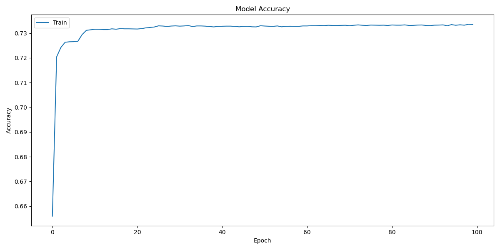
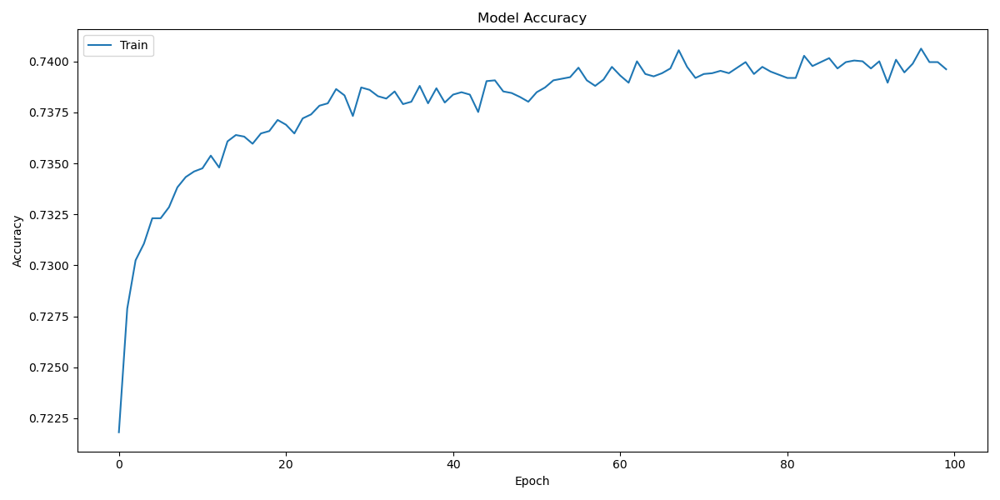
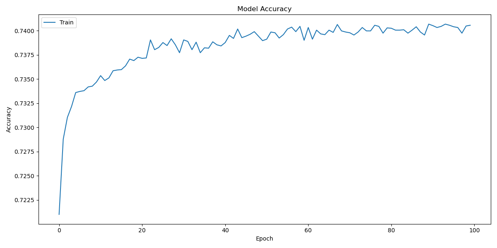
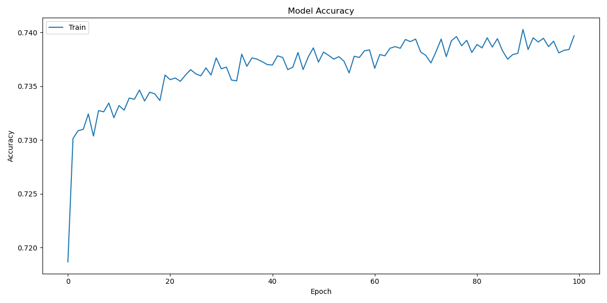

# deep-learning-challenge

## Overview of the Analysis

The purpose of this analysis is to create a binary classifier that can predict whether applicants will be successful if funded by the nonprofit foundation Alphabet Soup. Using the provided dataset, which includes information about past funded organizations, we aim to develop a neural network model that can accurately predict the success of future funding applicants.

## Data Preprocessing

1. **Target Variable(s)**:
   - `IS_SUCCESSFUL`: This variable indicates whether the funding was used effectively by the organization.

2. **Feature Variable(s)**:
   - `APPLICATION_TYPE`
   - `AFFILIATION`
   - `CLASSIFICATION`
   - `USE_CASE`
   - `ORGANIZATION`
   - `STATUS`
   - `INCOME_AMT`
   - `SPECIAL_CONSIDERATIONS`
   - `ASK_AMT`

3. **Variables Removed**:
   - `EIN`: Employer Identification Number, not relevant for the prediction.
   - `NAME`: Name of the organization, not relevant for the prediction.

The dataset was preprocessed by removing the `EIN` and `NAME` columns, encoding categorical variables using `pd.get_dummies`, and scaling the features using `StandardScaler`. The data was then split into training and testing sets.

## Compiling, Training, and Evaluating the Model

1. **Model Architecture and Hyperparameters**:
   
   **First Attempt (try1)**:
   - Structure:
     - First hidden layer: 5 neurons, Tanh activation
     - Second hidden layer: 5 neurons, ReLU activation
     - Output layer: 1 neuron, Sigmoid activation
   - Result: Accuracy of 0.7287
   
   **Second Attempt (try2)**:
   - Structure:
     - First hidden layer: 100 neurons, ReLU activation
     - Second hidden layer: 70 neurons, ReLU activation
     - Third hidden layer: 10 neurons, ReLU activation
     - Output layer: 1 neuron, Sigmoid activation
   - Result: Accuracy of 0.7271
   
   **Third Attempt (try3)**:
   - Structure:
     - First hidden layer: 90 neurons, ReLU activation
     - Second hidden layer: 70 neurons, ReLU activation
     - Third hidden layer: 50 neurons, ReLU activation
     - Fourth hidden layer: 80 neurons, ReLU activation
     - Output layer: 1 neuron, Sigmoid activation
   - Result: Accuracy of 0.7283
   
   **Fourth Attempt (try4)**:
   - Structure:
     - First hidden layer: 90 neurons, ReLU activation
     - Second hidden layer: 70 neurons, ReLU activation, 10% Dropout
     - Third hidden layer: 50 neurons, ReLU activation, 10% Dropout
     - Fourth hidden layer: 80 neurons, ReLU activation, 10% Dropout
     - Output layer: 1 neuron, Sigmoid activation
   - Result: Accuracy of 0.7290

2. **Model Performance**:
   - The best model (Fourth Attempt) achieved an accuracy of 0.7290, which is below the target performance of 75%.

3. **Steps to Improve Performance**:
   - Increased the number of neurons and added more hidden layers.
   - Experimented with different activation functions (Tanh, ReLU).
   - Introduced dropout layers to prevent overfitting.

## Model Accuracy and Loss Plots

These plots show the training accuracy and loss for each model attempt.

- **Model 1 Training Accuracy**:
  
  
  
- **Model 2 Training Accuracy**:
  
  
  
- **Model 3 Training Accuracy**:
  

  
- **Model 4 Training Accuracy**:
  
  

## Answering Key Questions

1. **What variable(s) are the target(s) for your model?**
   - The target variable for the model is `IS_SUCCESSFUL`.

2. **What variable(s) are the features for your model?**
   - The features for the model are `APPLICATION_TYPE`, `AFFILIATION`, `CLASSIFICATION`, `USE_CASE`, `ORGANIZATION`, `STATUS`, `INCOME_AMT`, `SPECIAL_CONSIDERATIONS`, and `ASK_AMT`.

3. **What variable(s) should be removed from the input data because they are neither targets nor features?**
   - The variables `EIN` and `NAME` should be removed from the input data as they are neither targets nor features.

4. **How many neurons, layers, and activation functions did you select for your neural network model, and why?**
   - The best model (Fourth Attempt) had:
     - First hidden layer: 90 neurons, ReLU activation
     - Second hidden layer: 70 neurons, ReLU activation
     - Third hidden layer: 50 neurons, ReLU activation
     - Fourth hidden layer: 80 neurons, ReLU activation
     - Output layer: 1 neuron, Sigmoid activation
   - These configurations were selected to increase the model complexity and capture more patterns in the data. Dropout layers were added to prevent overfitting.

5. **Were you able to achieve the target model performance?**
   - No, the target performance of 75% accuracy was not achieved. The best model achieved an accuracy of 0.7290.

6. **What steps did you take in your attempts to increase model performance?**
   - Increased the number of neurons and added more hidden layers.
   - Experimented with different activation functions (Tanh, ReLU).
   - Introduced dropout layers to prevent overfitting.
   - Set random seeds for reproducibility.

## Summary

The deep learning model developed for predicting the success of funding applicants for Alphabet Soup showed promising results but did not meet the target accuracy of 75%. The best model configuration achieved an accuracy of 0.7290. Despite various attempts to optimize the model, including adjusting the number of neurons, layers, and activation functions, as well as introducing dropout layers, the desired accuracy was not reached.

**Recommendations for Further Improvement**:
1. **Hyperparameter Tuning**:
   - Systematically search for the best hyperparameters using tools like Keras Tuner.
   
2. **Ensemble Methods**:
   - Combine predictions from multiple models to improve accuracy.

3. **Feature Engineering**:
   - Create new features or modify existing ones to provide more relevant information to the model.
   
4. **Alternative Models**:
   - Explore other classification algorithms such as Random Forest, Gradient Boosting, or Support Vector Machines. These models might capture different patterns in the data that a neural network might miss.

**Why Use a Different Model?**:
Different models, such as ensemble methods (e.g., Random Forest or Gradient Boosting), often perform better on classification problems with structured data due to their ability to handle various data distributions and interactions between features. These models can provide robustness and may achieve higher accuracy compared to neural networks, which might be more sensitive to the choice of hyperparameters and require extensive tuning.

By exploring these approaches, we can aim to improve the model's performance and achieve the target accuracy for predicting the success of funding applicants for Alphabet Soup.
